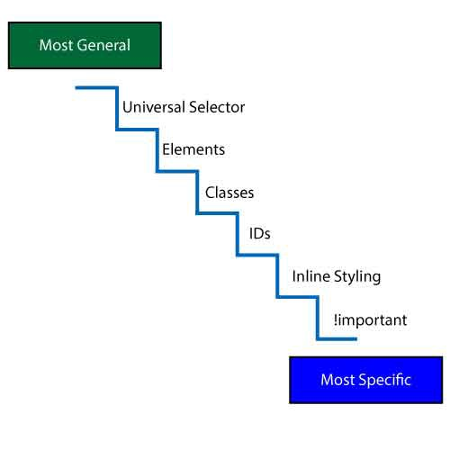
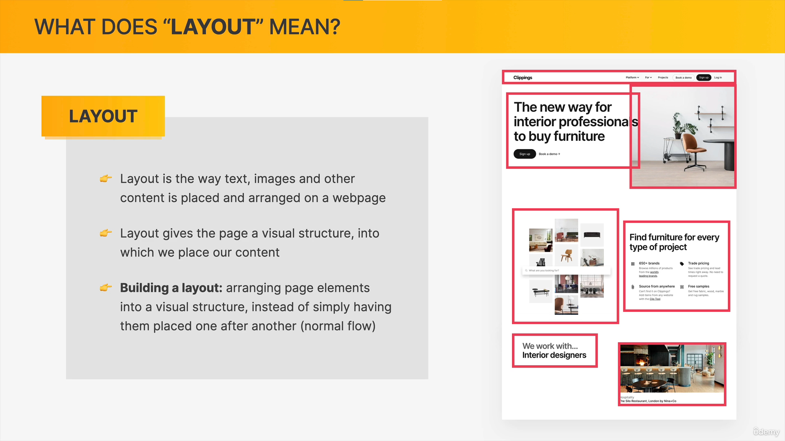
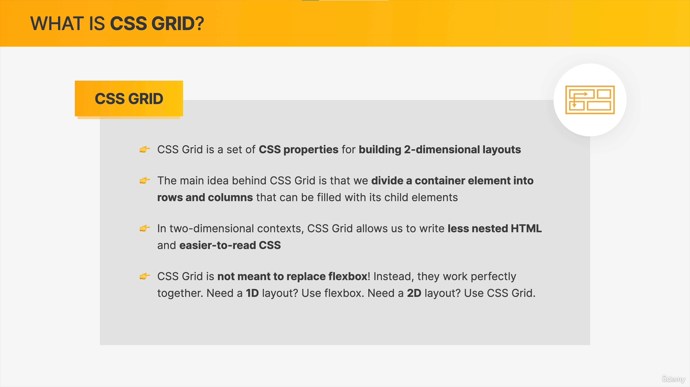

# <p style="text-align:center;">**CSS**</p>

# <p style="text-align:center; color:#33B3DE;">**PART-1 : BASICS of CSS :-**<p/>

# # Introduction

1.  CSS is a Casacading Style Sheet.
2.  It describes the visual style of HTML content.
3.  It consists of properties that define the styles of the HTML content.
4.  It consists of Selectors, declerations/styles, property, value ]-all these combined are called a Decleration Block.

```css
h1 {
  color: blue;
}
```

> **this is a small piece of a CSS Rule.**

---

# # Selectors

## There are various selectors such as:

> 1. Element selectors

```css
/* This selects every h1 element */

h1 {
}
```

> 2. ID selectors

```css
/* ID names can't be repeated. */
#IDname {
}
```

> 3. Class selectors

```css
/* class names are always used and they can be repeated as many times as required. */

.CLASSname {
}
```

> 4. Combined selectors

```css
/* This is the way to combine selectors to apply styles to every element combined. */

h1,
h2,
h3,
li {
}
```

> 5. Descendant selectors

```css
/* This selects the p elements that are the child elements of the article. */
article p {
}
```

> 6. Nested Descendant selectors

```css
/* This will select the p elements only that are the child of article that is further the child of the header.*/
header article p {
}
```

---

# # INLINE, INTERNAL and EXTERNAL CSS

## 1. Inline CSS

```html
<p style="color: blue;"></p>
```

> Here the _**CSS rule**_ is directly written in the **html** element as an **attribute value** defined by the **style** attribute.

## 2. Internal CSS

```html
<!DOCTYPE html>
<html lang="en">
  <head>
    <style>
      h1 {
        color: blue;
        background-color: red;
      }

      p {
        font-size: 20px;
      }
    </style>
  </head>
  <body></body>
</html>
```

> Here all the _**CSS rules**_ are written in the **Head** of the **HTML** document inside a **Style** element.

## 3. External CSS

_**Style.css** file_

```css
h1 {
  color: blue;
  background-color: red;
}

p {
  font-size: 20px;
}
```

_**Index.html** file_

```html
<!DOCTYPE html>
<html>
  <head>
    <title>External CSS</title>

    <link href="style.css" rel="stylesheet" />
  </head>
  <body>
    <h1>Hello World!</h1>
    <p>This is a paragraph</p>
  </body>
</html>
```

> In **External CSS** the **style.css** file is written seperately which contains all the **CSS Rules** for the html file **Index.html** and then this **css** file is attached/linked to the **html** file via the **link** element used in the head of the html document as shown.<br/>The **href** attribute holds the name of the css document to be attatched and the **rel** attribute/property holds the relation of the file attatched, in this case it is stylesheet.

---

# # Comments

> comments in CSS are written as :

```css
/* This is a comment */
```

---

# # Styling

> Some of the commonly used **Styles/Declerations** are :

```css
.CLASSname {
  font-size: 10px;
  font-weight: bold;
  font-family: sans-serif;
  font-style: italic;
  text-transform: uppercase;
  text-align: center;
  text-decoration: none;
  line-hieght: 1.5;
  list-style: none;
  color: blue;
  background-color: red;
  border: 5px solid black;
  width: 100%;
  hieght: auto;
  padding: 50px 40px;
  margin: 50px 20px;
}
```

---

# # Hyperlinks

> Hyperlinks are selected in CSS like :

```css
a:link,
a:visited {
}

a:hover,
a:active {
}
```

---

# # Pseudo-Classes

> Pseudo-classes are special type of selectors to target specific elements and they are written as :

```css
p:first-child {
  color: red;
}
p:last-child {
  color: red;
}
p:nth-child(2) {
  color: red;
}
p:nth-child(odd) {
  color: red;
}
```

> single " **:** " is used for a **Pseudo-Classes** as in the hyperlinks we used.

---

# # Pseudo-Elements

> Pseudo-Elements are just like the Pseudo-Classes but they use double "**::**" for usage such as :

```css
h1::first-letter {
}
h1::after {
  content: "";
  display: inline-block;
}
h1::before {
  content: "";
  display: inline-block;
}
```

---

# # Conflictions Between Selectors Due to Specificity



## <p style="text-align:center; color:#33B3DE;">**: This is the SPECIFICITY CHART for CSS Selectors**</p>

> Here the **Most General** selectors have the lowest priority as compared to the **Most Specific** selectors.

---

# # Inheritance

> TEXT related **Styles/Declerations** get transmitted from the parent element to the child element.<br/>**( \* ) Universal Selector** transfers every **style/decleration** to each and every element of the **html** document even if it is not a **text related style**.
>
> > The most common use of inheritance is for removing default **Margins** and **Paddings** from every element in order to style the page as our needs.<br/>**AND**<br/>To add the **Box-Sizing: Border-Box;** property to every element.

```css
* {
  margin: 0;
  padding: 0;
  box-sizing: border-box;
}
```

> > Used to put some **text related styles** to every element in the **body** i.e.

```css
body {
  font-family: "Rubik", sans-serif;
  line-height: 1;
  font-weight: 400;
  color: #555;

  /* Only works if there is nothing absolutely positioned in relation to body */
  overflow-x: hidden;
}
```

> > Also to define the **Font-size** of the **html** Document so as to work with rems in a better way i.e.

```css
html {
  /* font-size: 10px; */

  /* 10px / 16px = 0.625 = 62.5% */
  /* Percentage of user's browser font-size setting */
  font-size: 62.5%;
  overflow-x: hidden;
}
```

### **"These are the first things to write whenever we start writing our CSS stylesheet"** so as to insure the correct workflow of our code as we progress further.

---

# # Box-Model


## <p style="text-align:center; color:#33B3DE;">**: This is the CSS Box-Model**</p>

> <p style="font-size:18px;">Here the **Width** and **Hieght** are the given width and hieght to the content, **padding** is the free space inside of the **content-box**, **borders** are the borders applied these are also inside the content-box and **Margins** are the spaces outside the content-box which define the spaces between that content and other content present around it in the webpage<br/><br/>According to the **Box-Model** in **CSS** the _**Width**_ and _**Hieght**_ of any element is as follows:</p>
>
> > <br/> <p style="font-size:26px">**Width** = left-border + left-padding + width given + right-padding + right-border<br/><br/>**Hieght** = top-border + top-padding + width given + bottom-padding + bottom-border.<br/><br/></p>

---

# # Centering Our Page

<p style="color:#06BF65; font-size:18px"><strong>Note:</strong> TO center our page we need to first put all the contents of the page into a container 'div' element and then add "margin: 0 auto;" on this container 'div' element.

---

# # Types of Boxes


## 1. Block-Level Boxes

> <p style="font-size:18px;">1. These type of elements are formatted visually like blocks on a page covering the 100% width of its parent element irregular of the content width.
> <p style="font-size:18px;">2. These type of elements are placed vertically after one another by default nature.
> <p style="font-size:18px;">3. Box-Model works normally as it will be shown in the <strong>chrome developer tools</strong>.
> <p style="font-size:18px;">4. For eg. -heading elements <strong>(h1, h2, h3, h4, h5, h6), p, aside, div, article,</strong> etc.

## 2. Inline Boxes

> <p style="font-size:18px;">1. These type of elements occupy only the space required by the content 
> <p style="font-size:18px;">2. Thes elements do not create Line breaks.
> <p style="font-size:18px;">3. Box-Model works differently:<br/>(a) Hieghts and Widths do not apply at all.<br/>(b) Paddings and Margins only apply horizontally [Left and Right]
> <p style="font-size:18px;">4. For eg. -<strong>a , br, em, strong, abbr ,button, map, object, label, time, input</strong> etc.

## 2. Inline-Block Boxes

> <p style="font-size:18px;">1. Visually these elements look like inline boxes but behaviour of such elements matches block type boxes 
> <p style="font-size:18px;">2. They only occupy sace required by the content with no line breaks.
> <p style="font-size:18px;">3. Box model applies Normally. 
> <p style="font-size:18px;">4. To make a inline box type to inline-block type add the style <strong>{ display: inline-block; }</strong> to the element.

<p style="color:#06BF65; font-size:16px"><strong>Note:</strong> Display property can be used to change block type to inline or vice versa other than inline-block type only.

---

# # Absolute Positioning

<p style="font-size:20px;">Absolute positioning a element means to fix it on the page somewhwere by making it out of the flow of the page which is often referred to as out-flow in coding language that means the element will no longer be in the flow of the page with other elements adn it can even overlap other elements without affecting them.</p>


<p style="font-size:20px;">How is this achieved this is achieved by-<br/> <abbr style="font-weight:bold; color:#06bf65; font-size:24px;">First:</abbr> adding <strong>{ postion: absolute; }</strong> property to the element we need out of flow.<br/> <abbr style="font-weight:bold; color:#06bf65; font-size:24px;">Second:</abbr> adding <strong>{ postion: relative; }</strong> property to the element with respect to which we want the out-flowed element to fix its position.( By default it will fix relative to the viewport. )<br/><abbr style="font-weight:bold; color:#06bf65; font-size:24px;">Third:</abbr> Now we need to position the element by using <strong>top, bottom, left and right</strong> properties on the out-flowed element, to define its fixed place with respect to the relatively positioned element.</p>

<p style="color:#06BF65; font-size:18px"><strong>Note:</strong> Only the <strong>nearest Positioned ancestor/Preoccuring</strong> element with <strong>position: relative;</strong> property applied becomes the pivot point for the element with <strong>position: absolute;</strong> property applied on it i.e. this element gets fixed in relation to this preoccuring or positioned ancestor element

## <p style="color:#33B3DE; font-weight:bold;">Eg1.</p>

> This is the html

```html
<!DOCTYPE html>
<html lang="en">
  <head>
    <meta charset="UTF-8" />
    <meta http-equiv="X-UA-Compatible" content="IE=edge" />
    <meta name="viewport" content="width=device-width, initial-scale=1.0" />
    <title>Document</title>
  </head>
  <body>
    <div class="container">
      <h1>Heading</h1>
      <article>
        <p>this is a paragraph</p>
      </article>
      <button>LIKE</button>
    </div>
  </body>
</html>
```

> this is CSS

```css
.container {
  position: relative;
}
button {
  position: absolute;
  top: 50px;
  right: 50px;
}
```

## <p style="color:#33B3DE; font-weight:bold;">Eg2.</p>


---

# <p style="text-align:center; color:#33B3DE;">**PART-2 LAYOUTS: Floats, Flexbox AND Grid Layouts : -**</p>

# # Layouts



## - Types of layout (**page layout** and **component layout**)


## - Three Ways of building layouts


---

# <p style="color:#fdbc0b; font-size:32px; text-align:center; text-decoration:underline; font-weight:600; letter-spacing:1.4px">FLOAT LAYOUTS</p>

> <p style="font-size:18px">floats are used by <strong>Float property</strong></p>

```html
<div class="parent-Element">
  <h1>Heading</h1>
  <nav class="child-Element">
    <li>section1</li>
    <li>section2</li>
    <li>section3</li>
  </nav>
</div>
```

```css
h1 {
  float: right;
}
.child-element {
  float: left;
}
```

> <p style="font-size:18px">Float puts the element <strong>Out of the Flow</strong> just like <strong>Absolute positioning</strong> but it does not lets the element <strong>Overlap</strong> other elements instead all the other elements <strong>Wrap</strong> around the floated element ( In other words they float around the element ).</p>


> <p style="font-size:18px">As written the hieghts of parent elements collapse if all the child elements of that parent elements are floated</p>

<p style="font-weight:bold; color:#06bf65; font-size:24px;">Fixing the collapsing hieght problem:</p>

> First method is to create an Empty ' div ' element inside the parent element and add a clear property to it clearing all floats.

```html
<div class="parent-Element">
  <h1>Heading</h1>
  <nav class="child-Element">
    <li>section1</li>
    <li>section2</li>
    <li>section3</li>
  </nav>
  <div class="Empty-div"></div>
</div>
```

```css
.Empty-div {
  clear: both;
}
```

> Second method is called the <strong>Clearfix</strong> method in which we create the same empty element by <strong>pseudo-After</strong> element on a class named clearfix and use it on the parent element.

```html
<div class="parent-Element clearfix">
  <h1>Heading</h1>
  <nav class="child-Element">
    <li>section1</li>
    <li>section2</li>
    <li>section3</li>
  </nav>
</div>
```

```css
.clearfix::after {
  content: "";
  display: block;
  clear: both;
}
```

## **Box-Sizing**:Border-Box

> <p style="font-size:18px">This property defines the behaviour of BOX-MODEL.<br/>Default behaviour is content-box</p>
> 

---

# <p style="color:#fdbc0b; font-size:32px; text-align:center; text-decoration:underline; font-weight:600; letter-spacing:1.4px">FLEXBOX LAYOUTS</p>

> <p style="font-size:20px">Introduction to FLEXBOX : </p>


> <p style="font-size:18px">Flexbox is a Modern day layout method and is used by <strong>Display</strong> property set to <strong>Flex</strong> </p>

```css
.parent-element {
  display: flex;
}
```

> <p style="font-size:18px">In Flexbox there are terminologies which help us understand the basics of flexbox and for better knowledge We must atleast remember these few terms:<br/>1.<strong>Cross Axis</strong> that defines the flow of the layout Vertically.<br/>2.<strong>Main Axis</strong> that defines the flow of the layout Horizontally.<br/>3.<strong>Flex Items</strong> are the child elements of the parent element on which we set the flex property.<br/>4.<strong>Flex Container</strong> is the parent element on which we set the flex property.</p>


> <p style="font-size:18px">Properties and values used in flexbox are as follows :</p>

```css
/* FOR THE PARENT ELEMENT */
.container {
  display: flex;
  /* ------------to change the axis */
  flex-direction: column;
  /* ------------to define spaces/gaps between elements */
  gap: 10px;
  /* ------------to arrange items inside the container */
  justify-content: flex-start;
  align-items: stretch;

/* FOR THE FLEX ITEMS */
.item{
  /* ------------to arrange items inside the container */
  align-self: stretch;
  /* flex property consisting the values of
  (flex-grow, flex-shrink and flex-basis) as a SHORTHAND */
  flex: 0 1 auto;
}
```

> a FLEXBOX properties CheatSheet :
> 

---

# <p style="color:#fdbc0b; font-size:32px; text-align:center; text-decoration:underline; font-weight:600; letter-spacing:1.4px">CSS GRID LAYOUTS</p>

> <p style="font-size:20px">Introduction to CSS GRID : </p>
> 

> <p style="font-size:18px">CSS Grid is the latest and easiest layout method and is used by <strong>Display</strong> property set to <strong>Grid</strong> and then defining the no. of columns and row by <strong>Grid-Template-Columns</strong> and <strong>Grid-Template-Rows</strong> properties.</p>

```css
.parent-element {
  display: grid;
  grid-template-columns: 100px 150px;
  grid-template-rows: 100px 150px;
}
```

> <p style="font-size:18px">Just like Flexbox there are terminologies in CSS Grids too which help us understand the basics of the grid method. Few Important terms are:<br/>1.<strong>Column Axis</strong> is the Vertical axis of the grid.<br/>2.<strong>Row Axis</strong> is the Horizontal axis of the grid.<br/>3.<strong>Grid Container</strong> is the total space of the grid.<br/>4.<strong>Grid Items</strong> all the child elements of the grid container.</p>


> <p style="font-size:18px">These are few more CSS Grid terms.
> <p style="font-size:18px">1.<strong>Grid Lines:</strong> Used to span items.
> <p style="font-size:18px">2.<strong>Grid Tracks/columns:</strong> that go vertically. <strong>(Columns are defined horizontally but the tracks are vertical)</strong>
> <p style="font-size:18px">3.<strong>Grid Tracks/rows:</strong> that go horizontally  <strong>(Rows are defined vertically but the tracks are horizontal)</strong>
> <p style="font-size:18px">4.<strong>Grid Cell:</strong> Might be filled with a grid item or be empty space. 
> <p style="font-size:18px">5.<strong>Gutters/gaps:</strong> Free spaces between columns and/or rows


> <p style="font-size:18px"><strong>CSS grid Cheatsheet :</strong>


## # The **Fr** unit

> <p style="font-size:18px">The Fr units define the size of the grid columns or rows by fractions of the total width or height of the container.These are used for making responsive webpages

```css
.grid-container {
  grid-template-columns: 1fr 1fr 2fr;
  grid-template-rows: 1fr 2fr;
}
```

## # The **Repeat** property

> <p style="font-size:18px">The Repeat property is used for creating a number of columns or rows of same size with less writing of code.

```css
.grid-container {
  grid-template-columns: repeat(4, 1fr);
  grid-template-rows: repeat(2, 1fr);
}
```

## # The **Span** property

> <p style="font-size:18px">The Span property is used for spanning items in more than one grid cells.

```css
.grid-item {
  grid-column: 1 / span 3;
  grid-row: 1 / span 2;

  /* To span till the last of the grid */
  grid-column: 1/-1;
  grid-row: 1/-1;
}
```

## # We can also span elements inside the **Grid-tracks** as well as the **Grid-cells**.

```css
.grid-container {
  /* Aligning tracks inside container: distribute empty space */
  justify-content: center;
  align-content: center;

  /* Aligning items INSIDE cells: moving items around inside cells */
  align-items: end;
  justify-items: end;
}
```
