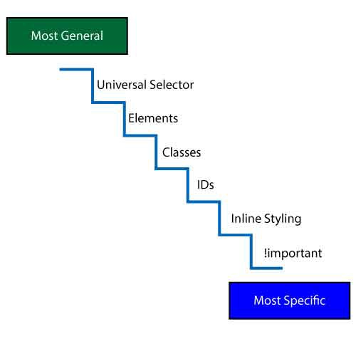
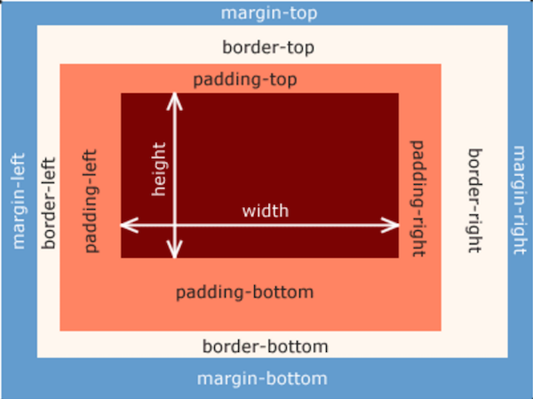

# <p style="text-align:center;">**CSS**</p>

---

# <p style="text-align:center; color:#33B3DE;">**PART-1 : BASICS of CSS :-**<p/>

# # Introduction

1.  CSS is a Casacading Style Sheet.
2.  It describes the visual style of HTML content.
3.  It consists of properties that define the styles of the HTML content.
4.  It consists of Selectors, declerations/styles, property, value ]-all these combined are called a Decleration Block.

```css
h1 {
  color: blue;
}
```

> **this is a small piece of a CSS Rule.**

---

# # Selectors

## There are various selectors such as:

> 1. Element selectors

```css
/* This selects every h1 element */

h1 {
}
```

> 2. ID selectors

```css
/* ID names can't be repeated. */
#IDname {
}
```

> 3. Class selectors

```css
/* class names are always used and they can be repeated as many times as required. */

.CLASSname {
}
```

> 4. Combined selectors

```css
/* This is the way to combine selectors to apply styles to every element combined. */

h1,
h2,
h3,
li {
}
```

> 5. Descendant selectors

```css
/* This selects the p elements that are the child elements of the article. */
article p {
}
```

> 6. Nested Descendant selectors

```css
/* This will select the p elements only that are the child of article that is further the child of the header.*/
header article p {
}
```

---

# # INLINE, INTERNAL and EXTERNAL CSS

## 1. Inline CSS

```html
<p style="color: blue;"></p>
```

> Here the _**CSS rule**_ is directly written in the **html** element as an **attribute value** defined by the **style** attribute.

## 2. Internal CSS

```html
<!DOCTYPE html>
<html lang="en">
  <head>
    <style>
      h1 {
        color: blue;
        background-color: red;
      }

      p {
        font-size: 20px;
      }
    </style>
  </head>
  <body></body>
</html>
```

> Here all the _**CSS rules**_ are written in the **Head** of the **HTML** document inside a **Style** element.

## 3. External CSS

_**Style.css** file_

```css
h1 {
  color: blue;
  background-color: red;
}

p {
  font-size: 20px;
}
```

_**Index.html** file_

```html
<!DOCTYPE html>
<html>
  <head>
    <title>External CSS</title>

    <link href="style.css" rel="stylesheet" />
  </head>
  <body>
    <h1>Hello World!</h1>
    <p>This is a paragraph</p>
  </body>
</html>
```

> In **External CSS** the **style.css** file is written seperately which contains all the **CSS Rules** for the html file **Index.html** and then this **css** file is attached/linked to the **html** file via the **link** element used in the head of the html document as shown.<br/>The **href** attribute holds the name of the css document to be attatched and the **rel** attribute/property holds the relation of the file attatched, in this case it is stylesheet.

---

# # Comments

> comments in CSS are written as :

```css
/* This is a comment */
```

---

# # Styling

> Some of the commonly used **Styles/Declerations** are :

```css
.CLASSname {
  font-size: 10px;
  font-weight: bold;
  font-family: sans-serif;
  font-style: italic;
  text-transform: uppercase;
  text-align: center;
  text-decoration: none;
  line-hieght: 1.5;
  list-style: none;
  color: blue;
  background-color: red;
  border: 5px solid black;
  width: 100%;
  hieght: auto;
  padding: 50px 40px;
  margin: 50px 20px;
}
```

---

# # Hyperlinks

> Hyperlinks are selected in CSS like :

```css
a:link,
a:visited {
}

a:hover,
a:active {
}
```

---

# # Pseudo-Classes

> Pseudo-classes are special type of selectors to target specific elements and they are written as :

```css
p:first-child {
  color: red;
}
p:last-child {
  color: red;
}
p:nth-child(2) {
  color: red;
}
p:nth-child(odd) {
  color: red;
}
```

> single " **:** " is used for a **Pseudo-Classes** as in the hyperlinks we used.

---

# # Pseudo-Elements

> Pseudo-Elements are just like the Pseudo-Classes but they use double "**::**" for usage such as :

```css
h1::first-letter {
}
h1::after {
  content: "";
  display: inline-block;
}
h1::before {
  content: "";
  display: inline-block;
}
```

---

# # Conflictions Between Selectors Due to Specificity



## <p style="text-align:center; color:#33B3DE;">**: This is the SPECIFICITY CHART for CSS Selectors**</p>

> Here the **Most General** selectors have the lowest priority as compared to the **Most Specific** selectors.

---

# # Inheritance

> TEXT related **Styles/Declerations** get transmitted from the parent element to the child element.<br/>**( \* ) Universal Selector** transfers every **style/decleration** to each and every element of the **html** document even if it is not a **text related style**.
>
> > The most common use of inheritance is for removing default **Margins** and **Paddings** from every element in order to style the page as our needs.<br/>**AND**<br/>To add the **Box-Sizing: Border-Box;** property to every element.

```css
* {
  margin: 0;
  padding: 0;
  box-sizing: border-box;
}
```

> > Used to put some **text related styles** to every element in the **body** i.e.

```css
body {
  font-family: "Rubik", sans-serif;
  line-height: 1;
  font-weight: 400;
  color: #555;

  /* Only works if there is nothing absolutely positioned in relation to body */
  overflow-x: hidden;
}
```

> > Also to define the **Font-size** of the **html** Document so as to work with rems in a better way i.e.

```css
html {
  /* font-size: 10px; */

  /* 10px / 16px = 0.625 = 62.5% */
  /* Percentage of user's browser font-size setting */
  font-size: 62.5%;
  overflow-x: hidden;
}
```

### **"These are the first things to write whenever we start writing our CSS stylesheet"** so as to insure the correct workflow our code as we progress further.

---

# # Box-Model



## <p style="text-align:center; color:#33B3DE;">**: This is the CSS Box-Model**</p>

> <p style="font-size:18px;">Here the **Width** and **Hieght** are the given width and hieght to the content, **padding** is the free space inside of the **content-box**, **borders** are the borders applied these are also inside the content-box and **Margins** are the spaces outside the content-box which define the spaces between that content and other content present around it in the webpage<br/><br/>According to the **Box-Model** in **CSS** the _**Width**_ and _**Hieght**_ of any element is as follows:</p>
>
> > <br/> <p style="font-size:26px">**Width** = left-border + left-padding + width given + right-padding + right-border<br/><br/>**Hieght** = top-border + top-padding + width given + bottom-padding + bottom-border.<br/><br/></p>
